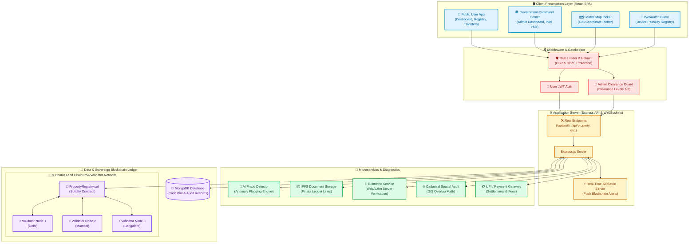

# ⛓️ Smart Bhoomi — National Land Infrastructure

Smart Bhoomi is a secure, blockchain-based government property registry system designed to provide transparent, tamper-proof, and dispute-free land governance. It integrates a sovereign Proof-of-Authority consensus chain, real-time cadastral spatial diagnostics, hardware-bound biometric authentication, and AI-driven fraud auditing.

---

## 🏛️ System Architecture



---

## 🚀 Key Features

*   **Sovereign Bharat Land Chain**: A Proof-of-Authority (PoA) blockchain network sealing land records and transaction history.
*   **GIS Spatial Surveyor**: Real-time CAD spatial overlap check to detect and prevent boundary disputes instantly.
*   **WebAuthn Passkey Authentication**: Strong cryptographic identity lock using physical biometric devices to authorize transfers.
*   **AI Fraud Intelligence**: Advanced risk diagnostic engine monitoring title anomalies, ownership ratios, and auditing document integrity.
*   **IPFS Document Vault**: Secure, decentralized document storage backing property deeds with IPFS hashes.
*   **Integrated UPI/Payment Gateway**: Electronic payment portal for property registration fees and transfer settlements.

---

## 🛠️ Technology Stack

### Backend
*   **Runtime & Framework**: Node.js, Express
*   **Database**: MongoDB (via Mongoose)
*   **Realtime Communication**: Socket.io (WebSockets)
*   **Security & Encryption**: WebAuthn (`@simplewebauthn/server`), JWT, Helmet, Rate-Limiting, AES-256

### Frontend
*   **Framework**: React (v18)
*   **Styling**: Vanilla CSS (Premium Glassmorphism & Bento Layout)
*   **Visual Assets & Maps**: React Leaflet (OpenStreetMap), Recharts (Analytics), Framer Motion (Micro-animations)
*   **Biometrics**: WebAuthn Browser APIs (`@simplewebauthn/browser`)

### Blockchain & Storage
*   **Ledger**: Solidity Smart Contracts (Bharat Land Chain)
*   **Storage**: IPFS (Kubo / Pinata)

---

## ⚙️ Local Development Setup

### 📋 Prerequisites
*   **Node.js** (v16+)
*   **MongoDB** (running locally on port `27017`)

### 🔌 Installation & Run Steps

1.  **Clone the Repository**
    ```bash
    git clone https://github.com/GauravYadav-G/Smart_Bhoomi.git
    cd Smart_Bhoomi
    ```

2.  **Environment Configuration**
    Copy the environment template and set up your variables:
    ```bash
    cp .env.example .env
    ```
    *(By default, `.env` is configured to connect to your local MongoDB instance at `mongodb://localhost:27017/property_registry`)*

3.  **Install Dependencies**
    Install dependencies for both backend and client:
    ```bash
    # Root dependencies
    npm install

    # Client dependencies
    cd client
    npm install
    cd ..
    ```

4.  **Build the Frontend**
    Build the React application:
    ```bash
    npm run build
    ```

5.  **Start the Application**
    Run the unified Express server which serves both the API and the React production build statically:
    ```bash
    npm start
    ```
    Access the portal locally at: **[http://localhost:5001](http://localhost:5001)**

---

## 📂 Project Architecture

```text
smart-bhoomi/
├── client/                  # React Frontend (Bento layout, GIS, WebAuthn client)
├── config/                  # Database connections
├── controllers/             # Express API controllers
├── middleware/              # Authentication & Security rules
├── models/                  # Mongoose Schemas (Property, Admin, Audit logs)
├── routes/                  # API endpoints
├── blockchain/              # Solidity contracts & Sovereign consensus service
├── services/                # Biometric, IPFS, and ML services
├── utils/                   # Spatial algorithms & helper services
├── server.js                # Server entry point
└── .env                     # Local environment keys (git-ignored)
```

---
*Developed under the Digital India Initiative.*
