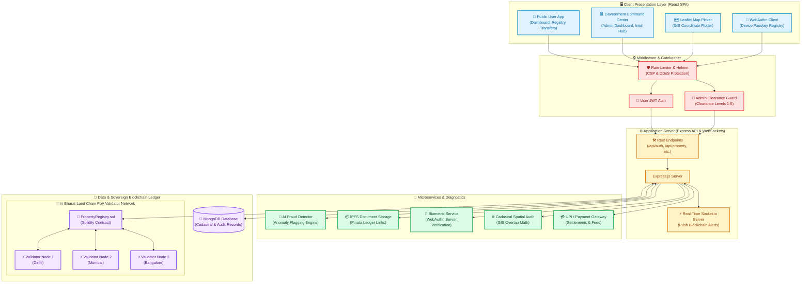

<div align="center">

# ⛓️ Smart Bhoomi

### 🇮🇳 National Land Infrastructure — Sovereign Blockchain Property Registry

[](https://smart-bhoomi.onrender.com/)
[](https://github.com/GauravYadav-G/Smart_Bhoomi)


<br/>

> **A secure, blockchain-based government property registry system** delivering transparent, tamper-proof, and dispute-free land governance — powered by a sovereign Proof-of-Authority consensus chain, real-time cadastral spatial diagnostics, hardware-bound biometric authentication, and AI-driven fraud auditing.

<br/>

[🚀 Live Demo](https://smart-bhoomi.onrender.com/) · [📖 Documentation](#-local-development-setup) · [🐛 Report Bug](https://github.com/GauravYadav-G/Smart_Bhoomi/issues) · [✨ Request Feature](https://github.com/GauravYadav-G/Smart_Bhoomi/issues)

</div>

---

## 📑 Table of Contents

- [✨ Key Features](#-key-features)
- [🏛️ System Architecture](#️-system-architecture)
- [🛠️ Technology Stack](#️-technology-stack)
- [⚙️ Local Development Setup](#️-local-development-setup)
- [📂 Project Architecture](#-project-architecture)
- [🔐 Security Features](#-security-features)
- [📡 API Endpoints](#-api-endpoints)
- [🤝 Contributing](#-contributing)
- [📜 License](#-license)

---

## ✨ Key Features

<table>
<tr>
<td width="50%">

### ⛓️ Sovereign Bharat Land Chain
A **Proof-of-Authority (PoA)** blockchain network with multi-node validator consensus sealing land records and full transaction history on an immutable ledger.

</td>
<td width="50%">

### 🗺️ GIS Spatial Surveyor
**Real-time cadastral spatial overlap detection** using GIS coordinate plotting on Leaflet maps — preventing boundary disputes before they happen.

</td>
</tr>
<tr>
<td width="50%">

### 🔑 WebAuthn Passkey Auth
**Hardware-bound biometric authentication** using FIDO2/WebAuthn passkeys to cryptographically authorize property transfers with device-level security.

</td>
<td width="50%">

### 🤖 AI Fraud Intelligence
**ML-powered anomaly detection engine** monitoring title patterns, ownership ratios, and document integrity to flag suspicious activity in real-time.

</td>
</tr>
<tr>
<td width="50%">

### 📦 IPFS Document Vault
**Decentralized document storage** backing property deeds with content-addressed IPFS hashes via Pinata — ensuring permanent, tamper-proof records.

</td>
<td width="50%">

### 💳 UPI / Payment Gateway
**Integrated Razorpay payment portal** for property registration fees, stamp duty, and transfer settlements with full transaction tracking.

</td>
</tr>
<tr>
<td width="50%">

### 🧬 e-KYC Verification
**Digital identity verification** pipeline with Aadhaar-style KYC, document validation, and multi-factor authentication for user onboarding.

</td>
<td width="50%">

### 🏛️ Government Command Center
**Multi-level admin dashboard** with clearance-based access (Levels 1-5), Intel Hub analytics, interactive India map, and blockchain admin controls.

</td>
</tr>
</table>

---

## 🏛️ System Architecture



---

## 🛠️ Technology Stack

<table>
<tr>
<th align="center">Layer</th>
<th align="center">Technology</th>
<th align="center">Purpose</th>
</tr>

<tr><td colspan="3" align="center"><strong>🖥️ Frontend</strong></td></tr>
<tr>
<td></td>
<td>React 18</td>
<td>SPA framework with hooks & context API</td>
</tr>
<tr>
<td></td>
<td>Vanilla CSS</td>
<td>Premium glassmorphism & bento grid layouts</td>
</tr>
<tr>
<td></td>
<td>React Leaflet</td>
<td>Interactive OpenStreetMap GIS plotting</td>
</tr>
<tr>
<td></td>
<td>Framer Motion</td>
<td>Fluid micro-animations & page transitions</td>
</tr>
<tr>
<td></td>
<td>Recharts</td>
<td>Analytics dashboards & data visualization</td>
</tr>

<tr><td colspan="3" align="center"><strong>⚙️ Backend</strong></td></tr>
<tr>
<td></td>
<td>Node.js 18+</td>
<td>Server runtime environment</td>
</tr>
<tr>
<td></td>
<td>Express 4.x</td>
<td>REST API framework with middleware pipeline</td>
</tr>
<tr>
<td></td>
<td>Socket.io</td>
<td>Real-time WebSocket push notifications</td>
</tr>
<tr>
<td></td>
<td>JWT + WebAuthn</td>
<td>Token auth & FIDO2 biometric passkeys</td>
</tr>

<tr><td colspan="3" align="center"><strong>💾 Data & Blockchain</strong></td></tr>
<tr>
<td></td>
<td>MongoDB + Mongoose</td>
<td>Document database for cadastral records</td>
</tr>
<tr>
<td></td>
<td>Solidity</td>
<td>Smart contracts on Bharat Land Chain (PoA)</td>
</tr>
<tr>
<td></td>
<td>IPFS + Pinata</td>
<td>Decentralized document storage & pinning</td>
</tr>

<tr><td colspan="3" align="center"><strong>🔒 Security</strong></td></tr>
<tr>
<td></td>
<td>Helmet + Rate Limiter</td>
<td>CSP headers, DDoS protection, request throttling</td>
</tr>
<tr>
<td></td>
<td>AES-256 Encryption</td>
<td>At-rest encryption for sensitive data</td>
</tr>
</table>

---

## ⚙️ Local Development Setup

### 📋 Prerequisites

| Requirement | Version |
|---|---|
| **Node.js** | v16+ |
| **MongoDB** | Running on port `27017` |
| **npm** | v8+ |

### 🔌 Quick Start

```bash
# 1️⃣  Clone the repository
git clone https://github.com/GauravYadav-G/Smart_Bhoomi.git
cd Smart_Bhoomi

# 2️⃣  Set up environment variables
cp .env.example .env
# Edit .env with your MongoDB URI, JWT secret, API keys, etc.

# 3️⃣  Install all dependencies
npm install
cd client && npm install && cd ..

# 4️⃣  Seed the admin account
npm run seed-admin

# 5️⃣  Build the React frontend
npm run build

# 6️⃣  Start the server
npm start
```

> **🌐 Access the portal at: [http://localhost:5001](http://localhost:5001)**

### 🔧 Development Mode

```bash
# Run backend with hot-reload
npm run dev

# Run React dev server (separate terminal)
npm run client
```

---

## 📂 Project Architecture

```
smart-bhoomi/
│
├── 🖥️  client/                     # React Frontend Application
│   └── src/
│       ├── pages/                  # User-facing pages
│       │   ├── LandingPage.js      #   ↳ Public landing & hero
│       │   ├── Dashboard.js        #   ↳ User property dashboard
│       │   ├── RegisterProperty.js #   ↳ Property registration wizard
│       │   ├── PropertyDetails.js  #   ↳ Single property deep-dive
│       │   ├── TransferRequests.js #   ↳ Ownership transfer flow
│       │   ├── BlockExplorer.js    #   ↳ Blockchain transaction viewer
│       │   ├── KYCDashboard.js     #   ↳ e-KYC verification portal
│       │   ├── PaymentGateway.js   #   ↳ Razorpay payment integration
│       │   └── Profile.js         #   ↳ User profile & settings
│       ├── admin/                  # Government admin portal
│       │   ├── components/
│       │   │   ├── AIMLPanel.js           # AI/ML fraud analytics
│       │   │   ├── BlockchainAdminPanel.js # Chain management
│       │   │   ├── IPFSAdminPanel.js      # Document vault admin
│       │   │   ├── IntelHub.js            # Intelligence dashboard
│       │   │   ├── InteractiveIndiaMap.js  # Geo-spatial India map
│       │   │   └── AdminSmartIDCard.js    # Digital ID generator
│       │   └── pages/              # Admin page layouts
│       └── components/             # Shared UI components
│
├── ⚙️  controllers/                # Express API business logic
├── 🛡️  middleware/                  # Auth guards & security layers
├── 📊  models/                     # Mongoose schemas & data models
├── 🛣️  routes/                     # REST API endpoint definitions
│   ├── auth.js                    #   ↳ /api/auth/*
│   ├── property.js                #   ↳ /api/property/*
│   ├── transfer.js                #   ↳ /api/transfer/*
│   ├── blockchain.js              #   ↳ /api/blockchain/*
│   ├── kyc.js                     #   ↳ /api/kyc/*
│   ├── documents.js               #   ↳ /api/documents/*
│   ├── admin.js                   #   ↳ /api/admin/*
│   └── intelligence.js            #   ↳ /api/intelligence/*
│
├── ⛓️  blockchain/                  # Sovereign chain layer
│   ├── PropertyRegistry.sol       #   ↳ Solidity smart contract
│   ├── SovereignChain.js          #   ↳ PoA consensus engine
│   └── BlockchainService.js       #   ↳ Chain interaction service
│
├── 🧠  services/                    # Microservice layer
│   ├── MLService.js               #   ↳ AI fraud detection
│   ├── BiometricService.js        #   ↳ WebAuthn/FIDO2
│   ├── ipfsService.js             #   ↳ IPFS + Pinata
│   ├── eKYCService.js             #   ↳ Identity verification
│   ├── AuditService.js            #   ↳ Activity audit trails
│   ├── SMSService.js              #   ↳ Twilio notifications
│   └── realtimeService.js         #   ↳ Socket.io push events
│
├── 🔧  utils/                      # Helper utilities
├── ⚙️  config/                     # Database & app configuration
├── 📄  server.js                   # Application entry point
├── 🌱  seed-admin.js               # Admin account seeder
└── 📝  .env                        # Environment variables (git-ignored)
```

---

## 🔐 Security Features

| Feature | Implementation |
|---|---|
| **Authentication** | JWT tokens + WebAuthn FIDO2 passkeys |
| **Admin Access Control** | 5-tier clearance level system |
| **API Protection** | Helmet CSP headers + express-rate-limit |
| **Data Encryption** | AES-256 for sensitive fields |
| **Blockchain Integrity** | PoA consensus with multi-validator signing |
| **Document Security** | Content-addressed IPFS storage (immutable) |
| **Session Security** | HTTP-only cookies, CSRF protection |
| **Input Validation** | express-validator on all endpoints |

---

## 📡 API Endpoints

<details>
<summary><strong>🔑 Authentication</strong> — <code>/api/auth/*</code></summary>

| Method | Endpoint | Description |
|---|---|---|
| `POST` | `/api/auth/register` | Register new user account |
| `POST` | `/api/auth/login` | User login with credentials |
| `POST` | `/api/auth/webauthn/register` | Register WebAuthn passkey |
| `POST` | `/api/auth/webauthn/verify` | Verify biometric passkey |
</details>

<details>
<summary><strong>🏠 Property Management</strong> — <code>/api/property/*</code></summary>

| Method | Endpoint | Description |
|---|---|---|
| `POST` | `/api/property/register` | Register new property |
| `GET` | `/api/property/list` | List user's properties |
| `GET` | `/api/property/:id` | Get property details |
| `PUT` | `/api/property/:id` | Update property info |
</details>

<details>
<summary><strong>🔄 Transfers</strong> — <code>/api/transfer/*</code></summary>

| Method | Endpoint | Description |
|---|---|---|
| `POST` | `/api/transfer/initiate` | Initiate ownership transfer |
| `PUT` | `/api/transfer/:id/approve` | Approve transfer request |
| `PUT` | `/api/transfer/:id/reject` | Reject transfer request |
</details>

<details>
<summary><strong>⛓️ Blockchain</strong> — <code>/api/blockchain/*</code></summary>

| Method | Endpoint | Description |
|---|---|---|
| `GET` | `/api/blockchain/blocks` | List blockchain blocks |
| `GET` | `/api/blockchain/verify/:id` | Verify property on chain |
| `GET` | `/api/blockchain/stats` | Chain statistics |
</details>

<details>
<summary><strong>🏛️ Admin</strong> — <code>/api/admin/*</code></summary>

| Method | Endpoint | Description |
|---|---|---|
| `POST` | `/api/admin/login` | Admin authentication |
| `GET` | `/api/admin/dashboard` | Admin dashboard data |
| `GET` | `/api/admin/analytics` | System-wide analytics |
</details>

---

## 🤝 Contributing

Contributions are welcome! Here's how to get started:

```bash
# 1. Fork the repository
# 2. Create your feature branch
git checkout -b feature/amazing-feature

# 3. Commit your changes
git commit -m "feat: add amazing feature"

# 4. Push to the branch
git push origin feature/amazing-feature

# 5. Open a Pull Request
```

---

## 📜 License

This project is licensed under the **MIT License** — see the [LICENSE](LICENSE) file for details.

---

<div align="center">

**Built with ❤️ for Digital India 🇮🇳**

[](https://smart-bhoomi.onrender.com/)

⭐ **Star this repo if you found it useful!** ⭐

</div>
